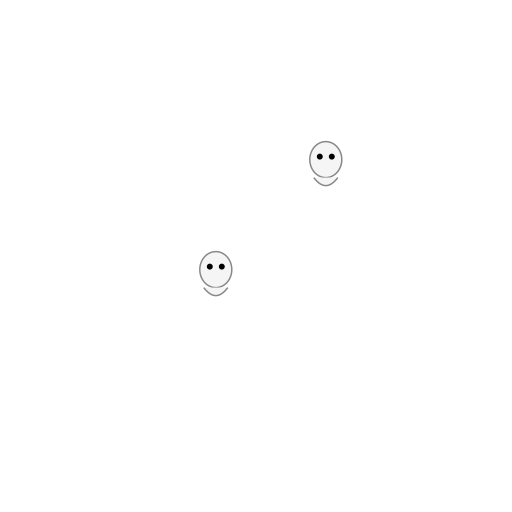

# Ghostparser

<p align="center">
   
</p>

**Ghostparser** detects introgression, between sampled species and from
unsampled "ghost" lineages, from a species tree and a set of gene trees. It
decomposes the ingroup into species triplets and, for each, compares how often
and how deep the gene trees disagree with the species tree. The engine is
[`ghostparser.orchestrator`](#running-the-orchestrator); an optional
[`ghostparser.ml`](#machine-learning) subpackage trains classifiers on the
summary statistics of simulated runs.

- [Installation](#installation)
- [Running the orchestrator](#running-the-orchestrator)
- [Inputs](#inputs)
- [Outputs](#outputs)
- [Configuration](#configuration)
- [Machine learning](#machine-learning)
- [Errors](#errors)
- [Testing](#testing)
- [Releases](#releases)

The method (the tests, their formulas and the literature behind them) is
described in [ORCHESTRATOR.md](ghostparser/orchestrator/ORCHESTRATOR.md);
every option is in [CONFIG.md](CONFIG.md).

## Installation

From GitHub, which installs the package into your environment so the commands
run from any directory:

```bash
pip install git+https://github.com/asuvorovlab/ghostparser.git
```

or `pip install` a wheel from the
[Releases](https://github.com/asuvorovlab/ghostparser/releases) page.

From a checkout:

```bash
pip install -r requirements.txt   # core
pip install .[ml]                 # adds scikit-learn for ghostparser.ml
pip install .[ml,wandb]           # adds Weights & Biases logging for the tuner
pip install .[dev]                # adds pytest and DendroPy for the tests
```

Poetry 2.x works too: `poetry install`, then `poetry run python -m ghostparser.orchestrator ...`.

## Running the orchestrator

```bash
# CLI flags
python -m ghostparser.orchestrator -st species.tree -gt genes.tree -og OutGroup

# config file; a flag given beside it overrides the file's value
python -m ghostparser.orchestrator -c run_config.yaml --seed 42

# start from a shipped sample (CONFIG.md lists them)
python -m ghostparser.orchestrator -c sample_configs/orchestrator_minimal.yaml

# check the inputs and exit without analysis
python -m ghostparser.orchestrator -st species.tree -gt genes.tree -og OutGroup --preflight-data-check
```

What a run does:

1. Roots the species tree where the outgroups branch off and prunes them;
   roots each gene tree from its farthest outgroup, at the common ancestor
   of the outgroups outside the ingroup, and prunes them.
2. Enumerates every ingroup triplet (or the ones a triplet or species filter
   names), written `(A, B, C)` with A and B the species-tree sisters.
3. Reads each triplet's rooted topology and tree height out of every gene
   tree.
4. Runs three tests per triplet (the discordant count test, the tree-height
   test and the direction test), corrects the p-values across the run, and
   classifies each triplet as `no_introgression`, `inflow_introgression`,
   `outflow_introgression`, `ghost_introgression` or `ambiguous`, with a
   bootstrap support value.
5. Writes the results and the consolidated introgression maps.

`--preflight-data-check` validates the trees first (outgroups missing from
gene trees, unresolved triplets, filter lines naming unknown taxa) and writes
`preflight_data_check.txt` without running any analysis.

## Inputs

Three inputs are required: the species tree (`-st`, branch lengths optional),
the gene trees (`-gt`, one Newick tree per line, every branch with a length;
a missing one is read as 0) and the outgroup label(s) (`-og`,
comma-separated, in any order: the species tree ranks them). Everything else has a default;
the full argument table, the config-file-only keys and the formats of the
filter and rename-map files are in [CONFIG.md](CONFIG.md).

Example species tree, gene trees and run:

```
(((TaxaA:0.1,TaxaB:0.2):0.3,TaxaC:0.4):0.5,(TaxaD:0.6,OutGroup:0.7):0.8);
```

```
((TaxaA:0.15,TaxaB:0.25):0.35,TaxaC:0.45);
((TaxaA:0.11,TaxaC:0.22):0.33,TaxaD:0.44);
```

```bash
python -m ghostparser.orchestrator -st species.tree -gt genes.tree -og OutGroup
```

## Outputs

| File | Contents |
| --- | --- |
| `orchestrator_triplet_results.tsv` | One row per triplet: counts, the three tests' statistics and p-values (raw and corrected), `decision_gate`, `classification`, `inference` in words, and the bootstrap support. Columns are described in [ORCHESTRATOR.md](ghostparser/orchestrator/ORCHESTRATOR.md#results-columns). |
| `summary_statistics.tsv` | With `generate_summary_stats`: per-triplet descriptive statistics of the heights per topology; the ML trainers' input. |
| `processed_<species tree>`, `processed_<gene trees>` | The cleaned, rooted and pruned trees. |
| `metrics.txt` | Run parameters, then per stage what it processed, its timings and what it found: rooting counts, classification and gate counts, permutation convergence. |
| `consolidation/` | `introgression_combined.png`, a heatmap of directed sampled introgression beside a bar chart of ghost targets, with the TSV matrices under `consolidation_data/`. |

Abbreviated results:

```
triplet	species_tree	n_con	n_dis1	n_dis2	dis1_topology	classification	bootstrap_value
TaxaA,TaxaB,TaxaC	((TaxaA,TaxaB),TaxaC);	7	3	2	BC	no_introgression	0.82
```

## Configuration

[CONFIG.md](CONFIG.md) documents every key and the path-resolution rules;
[sample_configs/](sample_configs/) holds a config for each common
scenario: minimal, every key at its default, a preflight check, a species
filter with summary statistics, a diagnostic look at a few triplets, a fast
screen in JSON. Defaults at a glance: `discordant_test: chi-square`,
`tree_height_calculation_strategy: AVG`, `p_value_correction: bfn`, every
`alpha` `0.05`, permutation resamples `2500`-`25000` with Wilson intervals,
`bootstrap_options.iterations: 100`, `min_support_value: 0.5`, `processes: 0`,
`overwrite: true`, consolidation and bootstrap on, `diagnostic`,
`generate_summary_stats` and `shape_diagnostics` off.

## Machine learning

`ghostparser.ml` trains multi-label classifiers on `summary_statistics.tsv`
and tunes their hyperparameters; see [ML.md](ghostparser/ml/ML.md).

```bash
python -m ghostparser.ml.random_forest -i results/summary_statistics.tsv -o results/ml_out
python -m ghostparser.ml.multi_knn -i results/summary_statistics.tsv -o results/ml_out
python -m ghostparser.ml.hyper_tune -c sample_configs/hyperparameter_tuning_random_forest.yaml
```

## Errors

A failed run prints one line naming the cause on stderr and exits with a
status that says what kind of failure it was, so a job script can tell a
finished run from a failed one. Once a run has started, the same line is the
last entry in `metrics.txt`. `--debug` (command line only) shows the full
traceback instead, for reporting a bug.

| Exit status | Meaning |
| --- | --- |
| 0 | The run finished, or the preflight check passed. |
| 1 | An input could not be used: a missing or malformed tree or filter file, outgroups that do not root the species tree, or unusable ML input data. |
| 2 | A config error: a missing or invalid key, or an unknown flag. |
| 3 | The preflight check ran and found defects; its report lists them. |
| 70 | An internal error, which is a bug; rerun with `--debug` for the traceback. |
| 130 | Interrupted with Ctrl-C. |

The messages worth knowing:

| Message | Cause |
| --- | --- |
| `Could not root the species tree ...` | No outgroup is in the tree, every taxon is one, or other taxa sit between the outgroups; the message lists the groups those taxa fall into, so the ones that are outgroups can be added to `--outgroup`. |
| `Species filter names N ingroup taxa; at least 3 are needed` | After skipping names that are not ingroup taxa, too few remain to form a triplet. |
| `Config fields triplet_filter and species_filter cannot both be set` | The two filters are alternatives. |
| `Config field species_rename_map: ...` | The map is missing, malformed, maps a label twice, gives two labels one name, or a name holds a tab, line break, comma, semicolon or `=`. |
| `Config field ... must be one of: ...` / `must be a boolean` / `must be an integer >= 0` | A key holds a value outside its type or choices. |
| `Invalid Newick format in ...` | A tree file could not be parsed. |
| `Missing required config field: ...` | A required path or the outgroup is absent. |

The ML loaders report their own config errors the same way, naming the key
and the accepted forms.

## Testing

```bash
pytest                    # everything
pytest -m core            # statistics and decisions
pytest -m config          # config loading and validation
pytest -m output          # files, columns and report fields
pytest -m integration     # entry points end to end
pytest -m parity          # one implementation against another (the cached
                          # triplet geometry against a DendroPy and a BioPython
                          # reference; every other test derives its expectations)
```

[tests/TESTS.md](tests/TESTS.md) maps every test and
[tests/TEST_IO.md](tests/TEST_IO.md) derives every expected value.

## Releases

A push of a `v*.*.*` tag builds and publishes the wheel:

```bash
git checkout main && git pull origin main
git tag -a v0.1.1 -m "Release v0.1.1"
git push origin v0.1.1
```

To undo a wrong tag, delete it locally and remotely (`git tag -d v0.1.1`,
`git push origin --delete v0.1.1`) and delete the GitHub release
(`gh release delete v0.1.1`).
